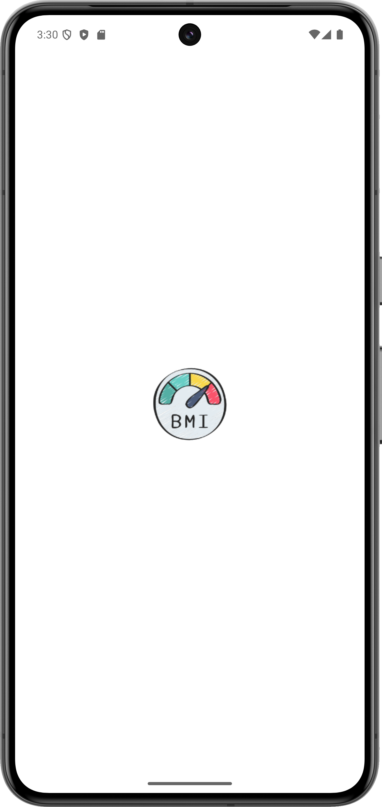
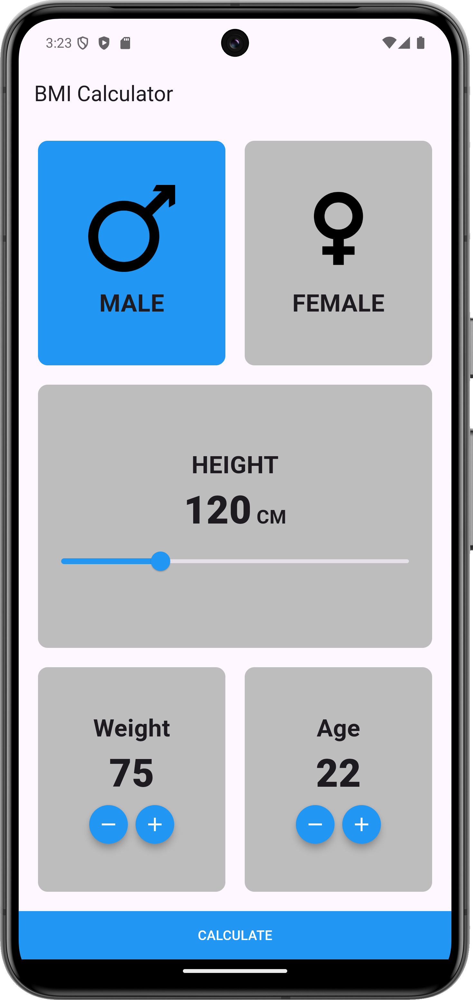
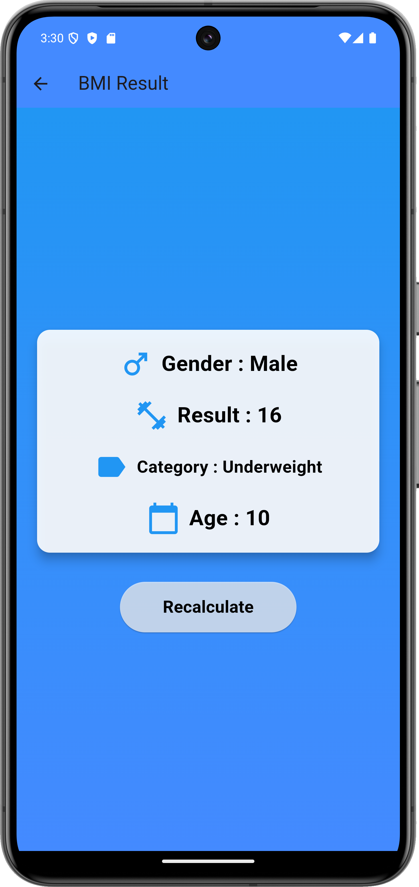

# BMI Calculator App

A Flutter-based Body Mass Index (BMI) Calculator that allows users to calculate their BMI and get categorized results based on their gender and age. The app is designed with a user-friendly interface and displays results in a visually appealing format.

## Features

- 📱 **Responsive Design**: Optimized for different screen sizes.
- 👨‍👩‍👧‍👦 **Gender-Based Calculation**: Provides BMI results for both male and female users.
- 📊 **Detailed Results**: Displays BMI result, category, and age.
- 🎨 **Beautiful UI**: Gradient background and smooth animations.

## Screenshots

<!-- Include some screenshots of your app here -->

  

## Installation

To run this project locally, follow these steps:

1. **Clone the repository**:

```bash
git clone https://github.com/your-username/bmi-calculator.git
cd bmi-calculator
